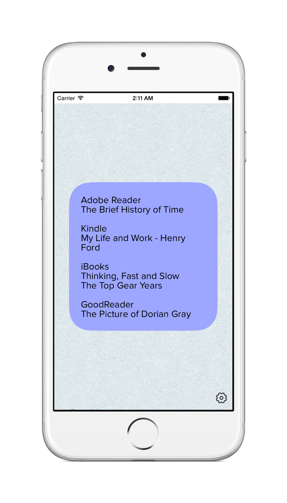
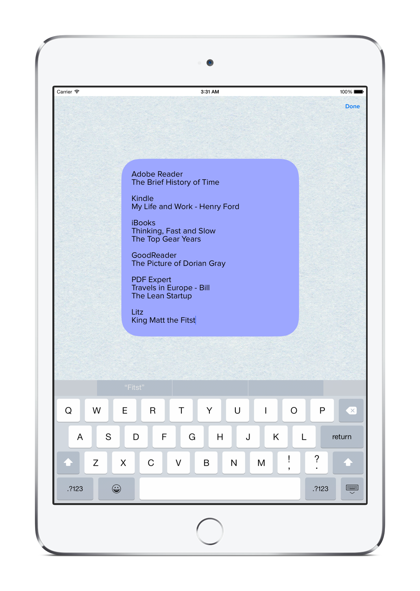

<a href="{{ page.appstoreLink }}" property="schema:image">{:.rounded .shadow width="100px"}</a>
<a href="{{ page.seaAppstoreLink }}" property="schema:image">{:.rounded .shadow width="100px"}</a>
<a href="{{ page.goldAppstoreLink }}" property="schema:image">{:.rounded .shadow width="100px"}</a>
<a href="{{ page.flameAppstoreLink }}" property="schema:image">{:.rounded .shadow width="100px"}</a>
<a href="{{ page.roseAppstoreLink }}" property="schema:image">{:.rounded .shadow width="100px"}</a>

### About

`Folder Note`

Get your folders organized. `Folder Note` is a tool for iOS that helps you to manage your apps in iOS folders and get your content organized.

### Examples

 

### Usage

1. Put `Folder Note` app inside your iOS folder.
2. Make a notes related to folder content. Whatever you want: content of apps, sketches, todos.
3. Enjoy your more organized iOS device

### Supported devices list:

- iPhone 4S
- iPhone 5
- iPhone 5S/C
- iPhone 6
- iPhone 6 Plus
- iPhone 6s
- iPhone 6s Plus
- iPhone SE
- iPad / iPad Mini / iPad Pro

